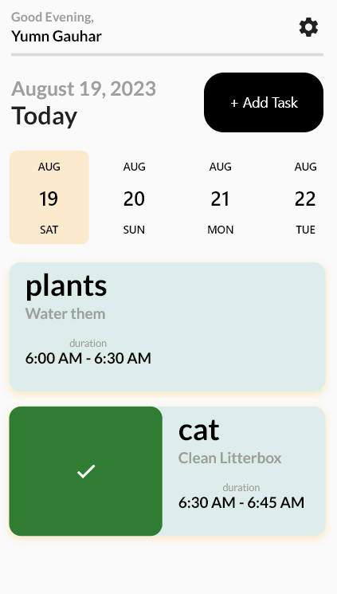
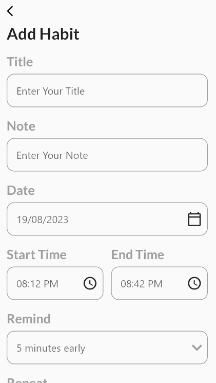
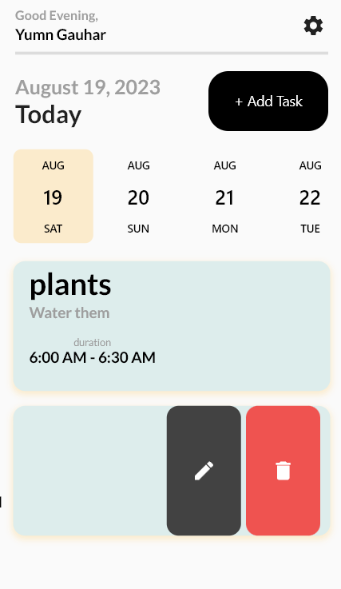

# Habito : Minimal Habit Tracker

This project aims to provide users with a straightforward habit tracking solution built using Flutter. It enables users to effortlessly monitor their daily habits and gauge their progress over time. The app's design prioritizes simplicity, ease of use, and adaptability to cater to various user preferences.

  
   
  

## Features

- **Add and Delete Habits:** Effortlessly include new habits or remove existing ones as needed.
- **Intuitive Progress Tracking:** User-friendly interface to monitor the progress of each habit.
- **Flexible Goal Setting:** Set goals for habits on a daily, weekly, or monthly basis, accommodating diverse preferences.
- **Comprehensive Statistics:** Access and analyze habit statistics over different time periods.

## Acknowledgments

This project finds its roots in the desire for an uncluttered, minimalist habit tracking app that can be tailored to individual users. Special recognition goes out to the Flutter community for their valuable support and sources of inspiration.

